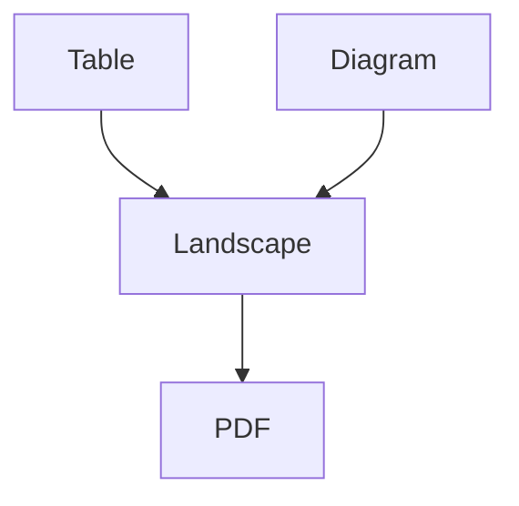

# Landscape appendix

This source is wrapped in the renderer-owned landscape environment.

| Component | Responsibility | Runtime |
|---|---|---|
| Go binary | Orchestration and policy enforcement | Native executable |
| Lua filters | Pandoc AST transformations | Pandoc |
| XeLaTeX | PDF typesetting | TeX Live |

<!-- diagram-alt: A Markdown table and Mermaid diagram are rendered on a landscape page. -->

