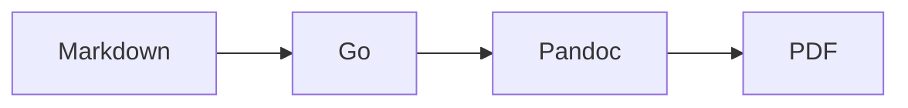

# Renderer smoke test

This page verifies ordinary Markdown and a footnote.[^footnote]

> [!WARNING]
> This warning is rendered as a styled, page-breakable box.

> **Planned**
>
> This planned capability uses its own visual treatment.

The inline expression $x \le y$ is passed through Pandoc's math representation.

<!-- diagram-alt: A request flows through the Go renderer and Pandoc to a PDF. -->

[^footnote]: Footnotes are handled by Pandoc and remain available to Lua filters.
