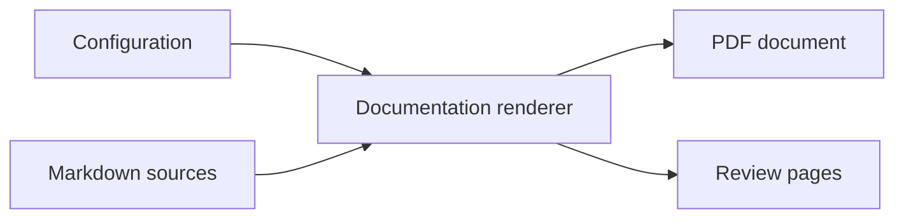

# Landscape layout

Wide comparison tables and diagrams may opt into a renderer-owned landscape
page while keeping authored Markdown portable.

| Module | Interface | Implementation | Verification |
|---|---|---|---|
| Validator | Markdown and configuration | Policy and structural checks | Diagnostics and exit status |
| Diagram renderer | Mermaid source | Native layout and vector PDF output | Captions and vector inspection |
| PDF renderer | Ordered guide sources | Pandoc, Lua filters, and XeLaTeX | Structural and visual gates |
| Theme system | Named preset and overrides | Fonts, colors, spacing, and page chrome | Showcase comparison |

<!-- diagram-alt: Configuration and Markdown feed the renderer, which produces both a PDF and visual-review pages. -->

