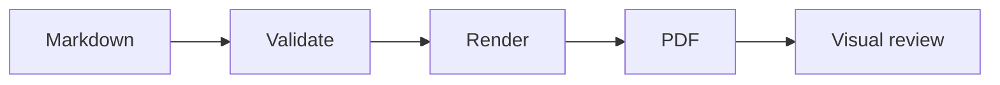
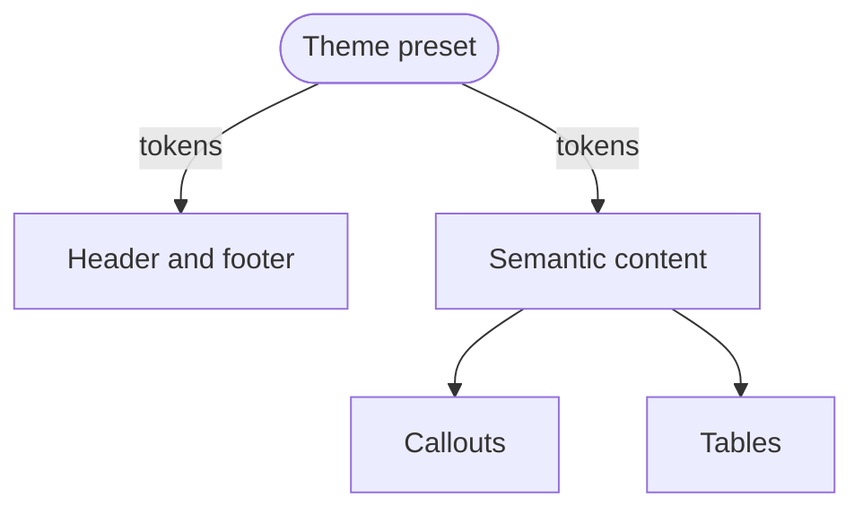

# Images and diagrams

The client mark below is a project-local SVG and should remain vector in the
combined document.

The flow proceeds from Markdown through validation and rendering to a reviewed
PDF artifact.

<!-- diagram-alt: Markdown passes through validation and rendering before the PDF is visually reviewed. -->

## Additional relationships

The second diagram verifies branching, labeled edges, and rounded nodes.

<!-- diagram-alt: A theme preset supplies typography and colors to both page chrome and semantic content. -->

